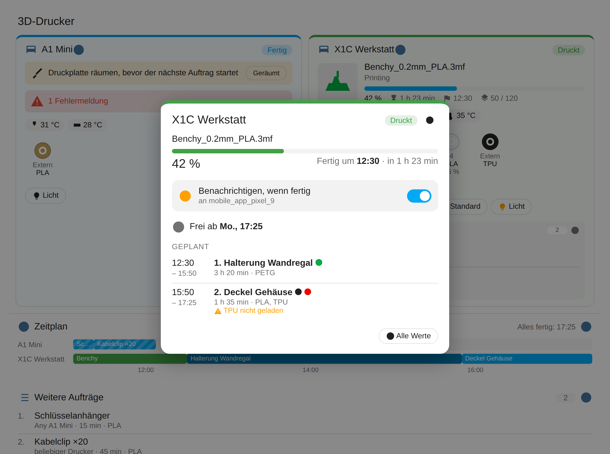
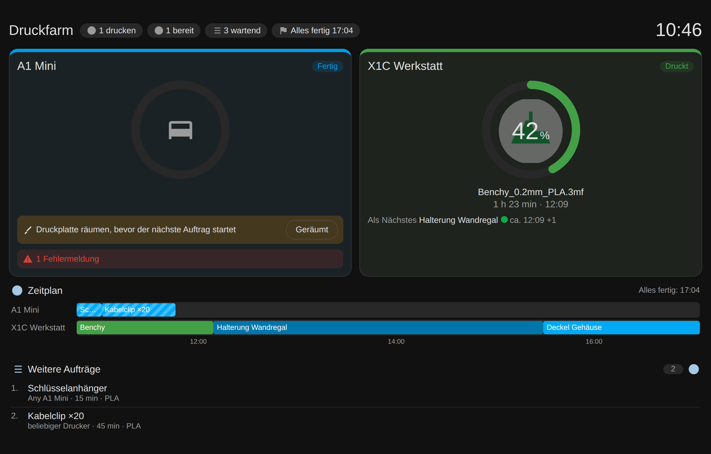

# Bambuddy für Home Assistant


🇬🇧 [English](README.md)

Inoffizielle Home-Assistant-Integration für [Bambuddy](https://github.com/maziggy/bambuddy), die selbst gehostete Verwaltung für Bambu-Lab-Drucker. Andere Integrationen zeigen einzelne Drucker – diese kennt die **ganze Druckfarm und ihre Warteschlange**.

- **Druckerstatus:** Status, aktueller Druck mit Vorschau, Fortschritt, Restzeit, Ende, Temperaturen, Fehler, „Druckplatte räumen“.
- **Warteschlange:** wartende und laufende Aufträge pro Drucker und insgesamt, als To-do-Liste, die sich direkt in Home Assistant **umsortieren und aufräumen** lässt.
- **Zeitplan:** voraussichtlicher Start und Ende jedes Auftrags, „Frei ab“ pro Drucker und „Druckfarm fertig um“.
- **Filament-Check** *(optional)*: warnt, wenn ein Auftrag ein Filament braucht, das im Drucker nicht geladen ist.
- **AMS und Filament:** pro Slot Filament mit Farbnamen (z. B. „PLA Basic · Jade White“) und Restmenge, Luftfeuchtigkeit und Temperatur des AMS.
- **Kamera, Steuerung:** Livebild; Pausieren, Fortsetzen, Abbrechen, Licht, Geschwindigkeit, „Druckplatte geräumt“.
- **Aktionen:** Auftrag nach vorne, überspringen, nochmal drucken oder eine Datei aus der Bibliothek drucken – aus Automationen, Skripten oder per Sprachassistent.
- **Statistik:** Drucke, Erfolgsquote, Druckzeit und Filament aus Bambuddy; **Kosten** *(optional)* für Filament und Energie.
- **Blueprints** *(optional)*: Handy-Benachrichtigungen mit Knopf **Geräumt** und automatisches Ein-/Ausschalten der Drucker-Steckdosen.
- **Dashboard-Karte** mit **Wandtablet-Modus**, wird mitgeliefert und automatisch geladen.


## Wo finde ich was?

| Was | Wo |
|---|---|
| **Alles auf einen Blick, Detailfenster, „Benachrichtigen, wenn fertig“** | die **Bambuddy-Karte** auf dem Dashboard; Tipp auf das ⚙ Zahnrad (oder den Druckernamen) öffnet das Detailfenster |
| Kartenoptionen (Darstellung, Zeitplan, Filament-Check, Bereiche) | Dashboard → Bearbeiten → Karte → Karteneditor |
| Abfrageintervall, **Kosten-Sensoren**, **Benachrichtigungsziele** | **Einstellungen** → **Geräte & Dienste** → **Bambuddy** → **Konfigurieren** |
| Warteschlange, „Druckfarm fertig um“, Statistik, Kosten | **Einstellungen** → **Geräte & Dienste** → **Bambuddy** → Gerät **Bambuddy** |
| Pro Drucker: „Frei ab“, „In Benutzung“, „Druckereignis“, „Benachrichtigen, wenn fertig“, AMS-Slots … | ebenda → Gerät des Druckers |
| Die Warteschlange als Liste (sortieren, löschen) | Seitenleiste → **To-do-Listen** → „Druck-Warteschlange“ |
| Benachrichtigungen mit „Geräumt“, automatisches Ein/Aus | [Blueprints](#benachrichtigungen-und-automatisches-ein-ausschalten-blueprints) importieren, dann **Einstellungen** → **Automationen & Szenen** → **Blueprints** |
| Aktionen (nochmal drucken, überspringen …) | **Entwicklerwerkzeuge** → **Aktionen**, nach „Bambuddy“ suchen |

## Voraussetzungen

- Home Assistant 2025.3 oder neuer (ab 2026.3 mit Integrations-Icon)
- Ein laufender Bambuddy-Server, den Home Assistant erreicht
- [HACS](https://hacs.xyz/) (empfohlen)

## Installation

### 1. API-Schlüssel in Bambuddy anlegen

Nur nötig, wenn in Bambuddy die Anmeldung aktiv ist. Bambuddy → **Einstellungen** → **API-Schlüssel** → **Schlüssel erstellen**, Name z. B. `Home Assistant`, dann anhaken:

| Recht | Wofür |
|---|---|
| **Status lesen** | alles, was angezeigt wird (Pflicht) |
| **Drucker steuern** | Pause, Fortsetzen, Abbrechen, Licht, Geschwindigkeit, „Druckplatte geräumt“ |
| **Warteschlange verwalten** | Aufträge umsortieren/entfernen, die Warteschlangen-Aktionen |

Den Schlüssel (beginnt mit `bb_`) sofort kopieren, er wird nur einmal angezeigt.

### 2. Über HACS installieren

1. **HACS** → oben rechts **⋮** → **Benutzerdefinierte Repositories**.
2. Repository `https://github.com/Notch001/ha-bambuddy-integration`, Typ **Integration** → **Hinzufügen**.
3. In HACS nach **Bambuddy** suchen, öffnen, **Herunterladen**.
4. Home Assistant neu starten.

<details>
<summary>Ohne HACS</summary>

Den Ordner `custom_components/bambuddy` nach `/config/custom_components/bambuddy` kopieren und Home Assistant neu starten.
</details>

### 3. Einrichten

1. **Einstellungen** → **Geräte & Dienste** → **Integration hinzufügen** → **Bambuddy**.
2. **Bambuddy-Adresse** (wie im Browser, z. B. `http://192.168.1.50:8000`) und **API-Schlüssel** eintragen (leer, wenn Bambuddy keine Anmeldung nutzt).

Es entstehen ein Gerät „Bambuddy“ (Warteschlange, Zeitplan, Statistik) und ein Gerät pro Drucker. Später hinzugefügte Drucker, AMS-Einheiten und Spulen erscheinen automatisch. Unter **Konfigurieren** lassen sich das Abfrageintervall (Standard 30 s) ändern, die **Kosten-Sensoren** einschalten und **Benachrichtigungsziele** (z. B. `mobile_app_dein_handy`) für „Benachrichtigen, wenn fertig“ wählen.

## Dashboard-Karte

Die Integration bringt eine eigene Karte mit und trägt sie automatisch als Dashboard-Ressource ein. Dashboard bearbeiten → **Karte hinzufügen** → **Bambuddy**. Die Karte findet alle Drucker selbst; im Editor wählst du Drucker, Darstellung und Bereiche.

```yaml
type: custom:bambuddy-card
title: 3D-Drucker            # optional
layout: card                 # card | wall (Wandtablet)
printers: []                 # optional: Geräte-IDs, leer = alle Drucker
show_temperatures: true
show_ams: true
show_controls: true          # braucht „Drucker steuern“
show_camera: false
show_timeline: true          # Zeitplan mit voraussichtlichen Zeiten
show_filament_check: false   # warnen, wenn Filament nicht geladen ist
show_printer_queue: true     # Aufträge für einen Drucker direkt darunter
show_queue: true             # alle übrigen Aufträge
collapse_queue: false        # Listen anfangs eingeklappt
queue_limit: 5               # max. Aufträge je Liste
```

- Die Karte nutzt immer die volle Breite ihres Abschnitts. Für die volle Seitenbreite: Abschnitt bearbeiten (Stift) und die Breite auf die ganze Seite stellen.


- **Detailfenster:** Tipp auf das ⚙ Zahnrad neben dem Status (oder auf den Druckernamen, im Wandmodus auf die Kachel) zeigt den laufenden Druck mit Endzeit, **Benachrichtigen, wenn fertig**, „Frei ab“ und alle geplanten Aufträge mit voraussichtlichem Start und Ende.
- Jeder Drucker ist eine Kachel mit farbigem oberem Rand für den Status; auf breiten Bildschirmen nebeneinander.
- Auftragslisten und Zeitplan klappen per Tipp auf die Überschrift ein; der Browser merkt sich das.
- Wartende Aufträge zeigen ihre Filamentfarben und den voraussichtlichen Start („ca. 14:30“).
- **Zeitplan:** ein Balken pro Drucker – der laufende Druck in Statusfarbe, danach die wartenden Aufträge. Aufträge für „beliebiger <Modell>“ sind schraffiert dort eingezeichnet, wo Bambuddy sie voraussichtlich hinschickt.
- **Wandtablet-Modus** (`layout: wall`): große Fortschrittsringe, Uhr und Übersicht (druckt / bereit / wartend / alles fertig um), der nächste Auftrag pro Drucker und ein großer Knopf **Geräumt**. Gedacht für ein Tablet an der Wand.


- **Eine Karte pro Drucker:** Karte mehrmals hinzufügen, in jeder einen Drucker wählen und `show_queue` bei allen außer einer ausschalten.

## Zeitplan und Filament-Check

So wird geschätzt: Ein Drucker ist belegt, bis die Restzeit seines Drucks abgelaufen ist; danach folgen seine wartenden Aufträge nacheinander (mit ihrer Druckdauer und ggf. geplanter Startzeit). Aufträge für „beliebiger <Modell>“ gehen an den Drucker dieses Modells, der zuerst frei wird. Es sind Schätzungen – Filamentwechsel, Platte räumen oder ein Fehldruck verschieben sie.

Der Filament-Check vergleicht die Filamenttypen eines Auftrags mit dem, was im AMS und am externen Halter des Druckers geladen ist, auf dem er laufen wird, und übernimmt Bambuddys eigene Prüfung „zu wenig Filament auf der Spule“. In der Karte ist er standardmäßig aus (`show_filament_check: true` schaltet ihn ein); die Daten stehen immer in den Auftrags-Attributen.

## Benachrichtigungen und automatisches Ein-/Ausschalten (Blueprints)

Beides ist optional. Mit einem Klick importieren, dann daraus eine Automation erstellen:

| Blueprint | Was er macht | Import |
|---|---|---|
| **Druck-Benachrichtigungen** | Nachricht aufs Handy bei Druck fertig / fehlgeschlagen / gestartet, „Druckplatte räumen“ (mit Knopf **Geräumt**, der den nächsten Auftrag freigibt) und Fehlern; Deutsch oder Englisch | [](https://my.home-assistant.io/redirect/blueprint_import/?blueprint_url=https%3A%2F%2Fgithub.com%2FNotch001%2Fha-bambuddy-integration%2Fblob%2Fmain%2Fblueprints%2Fautomation%2Fbambuddy%2Fprint_notifications.yaml) |
| **Automatisch ein/aus** | Schaltet die Steckdose eines Druckers aus, wenn er nicht mehr gebraucht wird (kein Druck, kein wartender Auftrag, abgekühlt), und wieder ein, sobald ein Auftrag auf ihn wartet | [](https://my.home-assistant.io/redirect/blueprint_import/?blueprint_url=https%3A%2F%2Fgithub.com%2FNotch001%2Fha-bambuddy-integration%2Fblob%2Fmain%2Fblueprints%2Fautomation%2Fbambuddy%2Fauto_power.yaml) |

Die Benachrichtigungen brauchen die Home-Assistant-App auf dem Handy; der Knopf **Geräumt** braucht „Drucker steuern“. Für das automatische Schalten pro Drucker eine Automation anlegen. Wer schon Bambuddy die Steckdosen schalten lässt („nach dem Druck ausschalten“), sollte nur eines von beiden nutzen.

## Aktionen

Nutzbar in Automationen, Skripten und mit Sprachassistenten (**Entwicklerwerkzeuge** → **Aktionen**):

| Aktion | Was sie macht |
|---|---|
| `bambuddy.move_job_to_front` | setzt einen wartenden Auftrag nach vorne (`job_id`) |
| `bambuddy.cancel_job` | überspringt einen wartenden Auftrag (`job_id`) |
| `bambuddy.start_job` | startet einen Auftrag, der auf manuellen Start wartet (`job_id`) |
| `bambuddy.print_again` | druckt einen früheren Druck nochmal, gesucht über `name` (neuester Treffer) oder `archive_id`; Drucker optional |
| `bambuddy.print_file` | druckt eine Bibliotheksdatei über `name` oder `file_id` auf einem Drucker |
| `bambuddy.clear_plate` | meldet Bambuddy die Druckplatte als geräumt |

Die Auftrags-IDs stehen in den `jobs`-Attributen und sind die Eintrags-IDs der To-do-Liste. `print_again` und `print_file` geben die neue Auftrags-ID zurück. Beispiel:

```yaml
action: bambuddy.print_again
data:
  name: Kabelclip
```

Die Warteschlangen-Aktionen brauchen „Warteschlange verwalten“. In der To-do-Liste „Druck-Warteschlange“ lassen sich wartende Aufträge per Ziehen umsortieren und löschen (= in Bambuddy überspringen).

## Entitäten

### Pro Drucker

| Entität | Beschreibung |
|---|---|
| Status | Bereit, Vorbereitung, Druckt, Pausiert, Fertig, Fehlgeschlagen, Offline |
| Aktueller Druck, Druckphase | Dateiname; z. B. „Heatbed preheating“ |
| Fortschritt, Restzeit, Voraussichtliches Ende | %, Minuten, Uhrzeit |
| Frei ab | wann alles für den Drucker Geplante fertig ist; Attribut `schedule` |
| Aktuelle Schicht, Schichten gesamt | |
| Düsen-, Bett-, Bauraumtemperatur | Ist- und Zielwerte |
| Warteschlange | Aufträge, die fest diesem Drucker zugewiesen sind; Attribute `next_job`, `jobs` |
| Fehlermeldungen | Anzahl der HMS-Meldungen; Details in `errors` |
| Online, Druckt, Fehler, Druckplatte räumen | An/Aus-Sensoren |
| In Benutzung | an, solange er druckt, ein Auftrag auf ihn wartet oder er noch heiß ist – aus heißt: darf ausgeschaltet werden |
| Benachrichtigen, wenn fertig | Schalter: an = der nächste fertige oder fehlgeschlagene Druck schickt eine Nachricht an die Ziele aus **Konfigurieren** (oder erscheint in den Home-Assistant-Benachrichtigungen), danach schaltet er sich selbst aus |
| Druckereignis | löst `print_started`, `print_finished`, `print_failed`, `plate_clear_required`, `error` aus (Attribute `job`, `next_job`) |
| Düse | Durchmesser; Typ in `nozzles` |
| Druckvorschau, Kamera | Bild des laufenden Drucks; Kamerabild und Livestream |
| Pausieren / Fortsetzen / Druck abbrechen, Druckplatte geräumt | Knöpfe, nur aktiv, wenn es passt |
| Bauraumbeleuchtung, Druckgeschwindigkeit | Licht; Leise, Standard, Sport, Turbo |
| Tür, WLAN-Signal, Lüfter, SD-Karte, Zeitraffer | standardmäßig deaktiviert |

### AMS und Filament

| Entität | Beschreibung |
|---|---|
| AMS 1 Slot 1 … / Externe Spule | Filament und Farbe, z. B. „PLA Basic · Jade White“. Attribute: `type`, `color`, `color_name`, `remaining` (%, RFID-Spulen), `nozzle_temp_min`, `nozzle_temp_max`, `active`, `ams`, `slot` |
| AMS 1 Luftfeuchtigkeit / Temperatur / Trocknung Restzeit | Trocknung nur, wenn das AMS trocknen kann |

### Bambuddy (Warteschlange, Zeitplan, Statistik)

| Entität | Beschreibung |
|---|---|
| Wartende / Laufende Druckaufträge | Anzahl; Attribute `next_job`, `jobs` |
| Druck-Warteschlange | To-do-Liste, sortierbar |
| Druckfarm fertig um | wann alle laufenden und schätzbaren wartenden Aufträge fertig sind |
| Drucke gesamt / diesen Monat / heute | Attribute bei „gesamt“: `successful`, `failed`, `cancelled`, `by_printer`, `by_filament_type` |
| Erfolgsquote | erfolgreich ÷ (erfolgreich + fehlgeschlagen) |
| Druckzeit gesamt, Filament gesamt / diesen Monat | Stunden, Gramm |
| *Filamentkosten gesamt / diesen Monat* | nur mit der Kosten-Option, in Bambuddys Währung |
| *Energie gesamt / diesen Monat, Energiekosten gesamt / diesen Monat* | nur mit der Kosten-Option; braucht in Bambuddy eingerichtete Steckdosen |

Jeder Eintrag in `jobs` enthält `id`, `name`, `status`, `printer`, `printer_id`, `position`, `scheduled_time`, `started_at`, `print_time_minutes`, `filament_type`, `filament_colors`, `filament_grams`, `estimated_cost`, `manual_start`, `waiting_reason`, `estimated_start`, `estimated_end`, `planned_printer_id`, `filament_ok`, `filament_missing`, `filament_short`.

## Updates

Jede neue Version erscheint als Release auf GitHub. HACS meldet sie unter **Einstellungen** → **Updates** (sofort prüfen: HACS → **Bambuddy** → **⋮** → **Informationen aktualisieren**). Danach Home Assistant neu starten.

## Fehlerbehebung

**Die Karte fehlt in der Kartenauswahl, zeigt dort einen Ladekreis oder im Bearbeitungsmodus „Custom element doesn't exist“.** Auf 0.11.1 oder neuer aktualisieren und die Seite neu laden. (Ältere Versionen haben die Karte zu früh geladen, bevor Home Assistant sein Frontend eingerichtet hatte.)

**Die Karte zeigt „Konfigurationsfehler“ / „Custom element doesn't exist“ (oft nur am Handy).** Seite neu laden. In der Companion-App: **Einstellungen** → **Companion App** → **Debugging** → **Frontend-Cache zurücksetzen**. Die Karte ist unter **Einstellungen** → **Dashboards** → **⋮** → **Ressourcen** eingetragen.

**Ein Knopf oder eine Aktion meldet fehlende Rechte.** Dem API-Schlüssel fehlt „Drucker steuern“ oder „Warteschlange verwalten“. Schlüssel in Bambuddy bearbeiten.

**Die Statistik bleibt „nicht verfügbar“.** Deine Bambuddy-Version bietet noch keine Statistik; alles andere funktioniert trotzdem.

**Debug-Protokoll:** **Einstellungen** → **Geräte & Dienste** → **Bambuddy** → **Debug-Protokollierung aktivieren**.

## Entwicklung

```bash
pip install -r requirements_test.txt
python -m pytest
```

Ein Release entsteht automatisch, wenn sich die Version in `custom_components/bambuddy/manifest.json` auf `main` ändert.

## Lizenz

MIT, siehe [LICENSE](LICENSE). Ein Community-Projekt, nicht verbunden mit dem Bambuddy-Projekt oder Bambu Lab.
