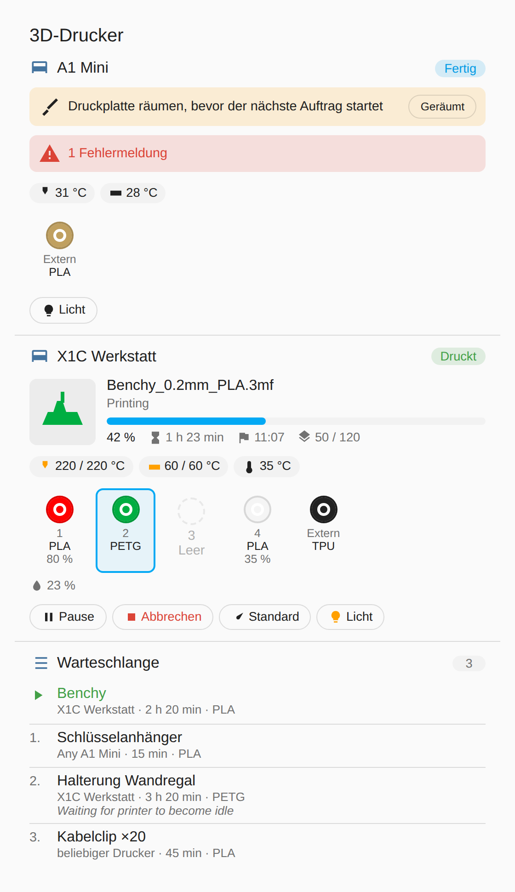

# Bambuddy für Home Assistant

Inoffizielle Home-Assistant-Integration für [Bambuddy](https://github.com/maziggy/bambuddy), die selbst gehostete Verwaltung für Bambu-Lab-Drucker.

Sie zeigt dir in Home Assistant:

- **Den Zustand jedes Druckers:** Status, aktueller Druck, Fortschritt, Restzeit, voraussichtliches Ende, Schicht, Temperaturen, Online/Offline, Fehler, „Druckplatte räumen“.
- **Die Warteschlange:** wartende und laufende Druckaufträge, insgesamt und pro Drucker, mit der Liste der Aufträge als Attribut.
- **AMS und Filament:** pro Slot Filament, Farbe und Restmenge, dazu Luftfeuchtigkeit und Temperatur jedes AMS.
- **Bilder:** Vorschau des aktuellen Drucks und das Kamerabild des Druckers.
- **Steuerung:** Pausieren, Fortsetzen, Abbrechen, Druckplatte als geräumt bestätigen, Bauraumbeleuchtung und Druckgeschwindigkeit.

## Voraussetzungen

- Home Assistant 2025.3 oder neuer
- Ein laufender Bambuddy-Server, den Home Assistant im Netzwerk erreicht
- [HACS](https://hacs.xyz/) (empfohlen)

## Installation

### 1. API-Schlüssel in Bambuddy anlegen

Nur nötig, wenn in Bambuddy die Anmeldung eingeschaltet ist.

1. Bambuddy im Browser öffnen → **Einstellungen** → **API-Schlüssel**.
2. **Schlüssel erstellen**, Name z. B. `Home Assistant`.
3. **Status lesen** anhaken. Wenn du den Drucker aus Home Assistant steuern willst (Pause, Abbrechen, Licht, Geschwindigkeit), zusätzlich **Drucker steuern**. Alle anderen Rechte können aus bleiben.
4. Den angezeigten Schlüssel (beginnt mit `bb_`) **sofort kopieren**. Er wird nur einmal angezeigt.

### 2. Integration über HACS installieren

1. In Home Assistant **HACS** öffnen.
2. Oben rechts auf die drei Punkte **⋮** → **Benutzerdefinierte Repositories**.
3. Als Repository `https://github.com/Notch001/ha-bambuddy-integration` eintragen, als Typ **Integration** wählen → **Hinzufügen**.
4. In HACS nach **Bambuddy** suchen, öffnen und **Herunterladen** klicken.
5. Home Assistant neu starten (**Einstellungen** → **System** → oben rechts Ein/Aus-Symbol → **Home Assistant neu starten**).

<details>
<summary>Ohne HACS (manuell)</summary>

Den Ordner `custom_components/bambuddy` aus diesem Repository nach `/config/custom_components/bambuddy` in deine Home-Assistant-Installation kopieren (z. B. mit dem Add-on „File editor“ oder „Samba share“), dann Home Assistant neu starten.
</details>

### 3. Integration einrichten

1. **Einstellungen** → **Geräte & Dienste** → unten rechts **Integration hinzufügen** → **Bambuddy** suchen.
2. **Bambuddy-Adresse** eintragen, also dieselbe Adresse, mit der du Bambuddy im Browser öffnest, z. B. `http://192.168.1.50:8000`.
3. Den **API-Schlüssel** aus Schritt 1 einfügen, oder das Feld leer lassen, wenn Bambuddy keine Anmeldung nutzt.
4. **Absenden**. Danach erscheinen ein Gerät „Bambuddy“ für die Warteschlange und ein Gerät pro Drucker.

Neu in Bambuddy angelegte Drucker tauchen automatisch auf. Das Abfrageintervall (Standard: 30 Sekunden) lässt sich unter **Konfigurieren** bei der Integration ändern.

## Entitäten

### Pro Drucker

| Entität | Beschreibung |
|---|---|
| Status | Bereit, Vorbereitung, Druckt, Pausiert, Fertig, Fehlgeschlagen, Offline |
| Aktueller Druck | Name des laufenden Drucks |
| Fortschritt | in % |
| Restzeit | in Minuten |
| Voraussichtliches Ende | Uhrzeit |
| Aktuelle Schicht / Schichten gesamt | |
| Düsen-, Bett-, Bauraumtemperatur | Ist- und Zielwerte (Bauraum und zweite Düse nur, wenn der Drucker sie meldet) |
| Warteschlange | Anzahl der Aufträge, die fest diesem Drucker zugewiesen sind; Attribute `next_job` und `jobs` |
| Fehlermeldungen | Anzahl der HMS-Meldungen; Details im Attribut `errors` |
| Druckphase | z. B. „Heatbed preheating“, „Auto bed leveling“ |
| Online, Druckt, Fehler, Druckplatte räumen | An/Aus-Sensoren |
| Düse | Durchmesser; Typ im Attribut `nozzles` |
| Tür, WLAN-Signal, Lüfter, SD-Karte, Zeitraffer | standardmäßig deaktiviert, bei Bedarf einschalten |

### AMS und Filament (pro Drucker)

| Entität | Beschreibung |
|---|---|
| AMS 1 Slot 1 … | Filamentname (z. B. „PLA Basic“), „Leer“ oder „Unbekannt“. Das Symbol zeigt die Filamentfarbe. Attribute: `type`, `color`, `remaining` (in %, nur bei Bambu-Spulen mit RFID), `nozzle_temp_min`, `nozzle_temp_max`, `active` (wird gerade gedruckt) |
| Externe Spule | dasselbe für die Spule am Halter außen |
| AMS 1 Luftfeuchtigkeit / Temperatur | |
| AMS 1 Trocknung Restzeit | nur bei Druckern, deren AMS trocknen kann |

### Bilder (pro Drucker)

| Entität | Beschreibung |
|---|---|
| Druckvorschau | Vorschaubild des laufenden Drucks aus der 3MF-Datei |
| Kamera | Kamerabild und Livestream, über Bambuddy weitergeleitet |

### Steuerung (pro Drucker)

Braucht beim API-Schlüssel das Recht **Drucker steuern**. Ohne dieses Recht zeigt Home Assistant beim Drücken eine Fehlermeldung, sonst passiert nichts.

| Entität | Beschreibung |
|---|---|
| Pausieren / Fortsetzen / Druck abbrechen | Knöpfe, nur aktiv, wenn es gerade passt (z. B. „Fortsetzen“ nur bei pausiertem Druck) |
| Druckplatte geräumt | bestätigt nach einem fertigen Druck, dass die Platte frei ist, damit Bambuddy den nächsten Auftrag starten kann |
| Bauraumbeleuchtung | Licht an/aus |
| Druckgeschwindigkeit | Leise, Standard, Sport, Turbo (nur während eines Drucks) |

### Bambuddy (Warteschlange)

| Entität | Beschreibung |
|---|---|
| Wartende Druckaufträge | Anzahl; Attribute `next_job` und `jobs` (max. 50 Einträge) |
| Laufende Druckaufträge | Anzahl; Attribut `jobs` |
| Druck-Warteschlange | Die Warteschlange als **Liste** (To-do-Liste, nur lesen), siehe unten |

Jeder Eintrag in `jobs` enthält: `id`, `name`, `status`, `printer` (bei nicht zugewiesenen Aufträgen z. B. „Any A1 Mini“), `position`, `scheduled_time`, `started_at`, `print_time_minutes`, `filament_type`, `filament_grams`, `manual_start`, `waiting_reason`.

## Update

HACS meldet neue Versionen automatisch unter **Einstellungen** → **Updates**. Nach dem Update Home Assistant neu starten.

## Dashboard-Karte

Die Integration bringt eine eigene Karte mit. Sie wird automatisch geladen, du musst nichts extra installieren.



**Hinzufügen:** Dashboard bearbeiten → **Karte hinzufügen** → nach **Bambuddy** suchen. Die Karte findet alle Drucker selbst. Im Karteneditor kannst du Drucker auswählen und Bereiche (Temperaturen, AMS, Steuerung, Kamera, Warteschlange) ein- und ausblenden.

Oder per YAML:

```yaml
type: custom:bambuddy-card
title: 3D-Drucker            # optional
printers: []                 # optional: Geräte-IDs, leer = alle Drucker
show_temperatures: true
show_ams: true
show_controls: true          # braucht das Recht „Drucker steuern“
show_camera: false
show_queue: true
queue_limit: 5               # so viele wartende Aufträge werden gezeigt
```

Ein Klick auf einen Wert öffnet die Details der jeweiligen Entität. „Abbrechen“ fragt vorher nach.

Falls die Karte nach einem Update nicht erscheint: Browser-Seite einmal neu laden (am Handy die Companion-App: **Einstellungen** → **Companion App** → **Debugging** → **Frontend-Cache zurücksetzen**).

## Warteschlange als Liste anzeigen

Die Entität **Druck-Warteschlange** ist eine To-do-Liste. Laufende Drucke stehen oben mit ▶, darunter die wartenden Aufträge in der Reihenfolge, in der Bambuddy sie startet. Unter jedem Auftrag stehen Drucker, Druckdauer, Filament und, falls vorhanden, warum er noch wartet. Bearbeitet wird die Warteschlange weiterhin in Bambuddy; in Home Assistant ist die Liste nur zum Anschauen.

- **Seitenleiste:** Unter **To-do-Listen** taucht „Bambuddy Druck-Warteschlange“ automatisch auf.
- **Dashboard:** Dashboard bearbeiten → **Karte hinzufügen** → **To-do-Liste** → als Entität „Bambuddy Druck-Warteschlange“ wählen. Oder per YAML:

```yaml
type: todo-list
entity: todo.bambuddy_druck_warteschlange
title: Druck-Warteschlange
```

Die Entitäts-ID kann bei dir anders heißen; du findest sie unter **Einstellungen** → **Geräte & Dienste** → **Bambuddy** → Gerät **Bambuddy**.

## Beispiel: eigene Markdown-Karte

Wer die Liste anders gestalten will, kann die Attribute des Sensors „Wartende Druckaufträge“ in einer Markdown-Karte verwenden. Ersetze `sensor.bambuddy_wartende_druckauftrage` durch die Entitäts-ID deines Sensors „Wartende Druckaufträge“. Du findest sie unter **Einstellungen** → **Geräte & Dienste** → **Bambuddy** → Gerät **Bambuddy**.

```yaml
type: markdown
title: Druck-Warteschlange
content: >
  
  
  {{ loop.index }}. **{{ job.name }}** – {{ job.printer or 'beliebiger Drucker' }}
   ({{ job.print_time_minutes }} min)
  
  Keine Aufträge in der Warteschlange.
  
```

## Entwicklung

```bash
pip install -r requirements_test.txt
python -m pytest
```
